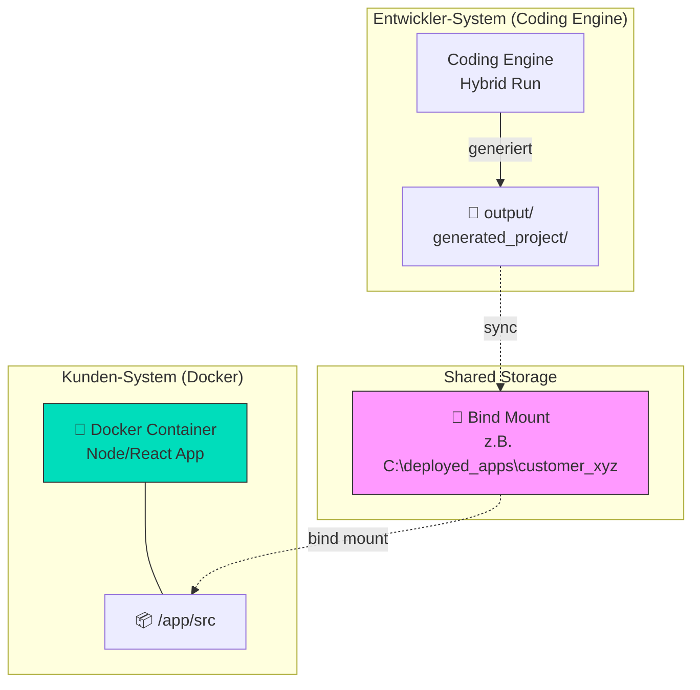
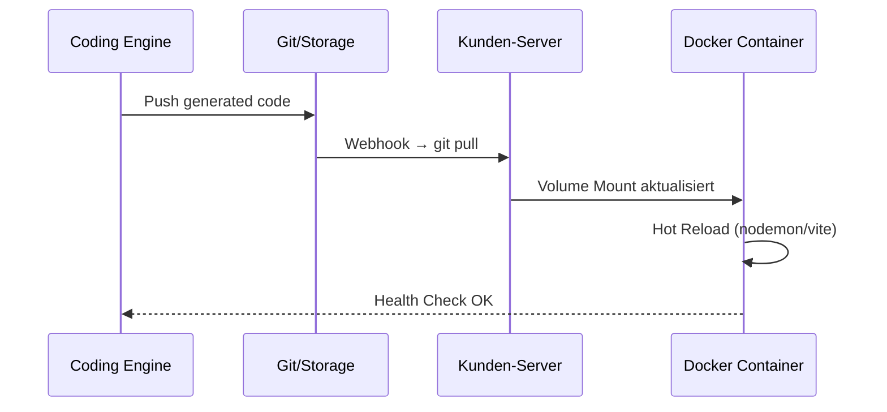
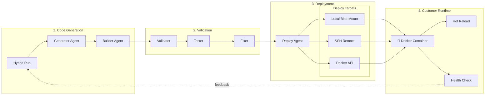

# Docker Live-Deployment Architektur

## Übersicht

Dieses Dokument beschreibt, wie der Coding Engine generierte Software über Docker Bind Mounts 
direkt auf Kundensysteme deployen kann - **live und ohne manuellen Eingriff**.

## Konzept: Bidirektionale Volume Mounts



## Architektur-Varianten

### Variante 1: Lokales Bind Mount (Ihr Screenshot)

```yaml
# docker-compose.customer.yml
version: "3.9"

services:
  customer-app:
    image: node:20-alpine
    container_name: customer-app-live
    volumes:
      # Bind Mount: Host-Verzeichnis → Container
      - type: bind
        source: C:/deployed_apps/customer_xyz
        target: /app
    ports:
      - "3000:3000"
    command: npm run dev  # Hot Reload aktiviert
    environment:
      - CHOKIDAR_USEPOLLING=true  # Für Windows File Watching
```

**Workflow:**
1. Coding Engine generiert Code → `output/project_xyz/`
2. Sync-Script kopiert nach `C:/deployed_apps/customer_xyz/`
3. Docker Container sieht Änderungen sofort (Hot Reload)

### Variante 2: Remote Deployment via SSH + Bind Mount



### Variante 3: Docker Compose mit Watch Mode (Neue Docker Feature!)

```yaml
# compose.yml mit watch (Docker Compose v2.22+)
version: "3.9"

services:
  frontend:
    build: .
    develop:
      watch:
        - action: sync
          path: ./src
          target: /app/src
        - action: rebuild
          path: package.json
    ports:
      - "3000:3000"
```

## Implementierung für Coding Engine

### 1. DeployAgent Erweiterung

```python
# src/agents/deploy_agent.py (Konzept)

class LiveDeployAgent(AutonomousAgentBase):
    """Agent für Live-Deployment über Docker Bind Mounts."""
    
    async def _do_action(self, event: Optional[Dict[str, Any]] = None) -> None:
        output_dir = self.shared_state.output_dir
        deploy_config = self._load_deploy_config()
        
        for target in deploy_config.get("targets", []):
            if target["type"] == "bind_mount":
                await self._deploy_to_bind_mount(output_dir, target)
            elif target["type"] == "remote_ssh":
                await self._deploy_via_ssh(output_dir, target)
            elif target["type"] == "docker_api":
                await self._deploy_via_docker_api(output_dir, target)
    
    async def _deploy_to_bind_mount(self, source: Path, target: dict):
        """Synchronisiert Dateien zu einem lokalen Bind Mount."""
        dest = Path(target["path"])
        
        # Inkrementelles Sync (nur geänderte Dateien)
        changed_files = self._get_changed_files(source, dest)
        
        for file in changed_files:
            src_file = source / file
            dst_file = dest / file
            dst_file.parent.mkdir(parents=True, exist_ok=True)
            shutil.copy2(src_file, dst_file)
            
            log.info("file_deployed", file=str(file), target=str(dest))
        
        # Optional: Container-Restart falls kein Hot Reload
        if target.get("restart_container"):
            await self._restart_container(target["container_name"])
```

### 2. Deployment-Konfiguration

```json
// deploy.config.json
{
  "targets": [
    {
      "name": "local-dev",
      "type": "bind_mount",
      "path": "C:/deployed_apps/port_manager",
      "hot_reload": true,
      "watched_extensions": [".tsx", ".ts", ".css", ".json"]
    },
    {
      "name": "customer-alpha",
      "type": "remote_ssh",
      "host": "customer-alpha.example.com",
      "path": "/opt/apps/port_manager",
      "restart_command": "docker restart customer-app"
    },
    {
      "name": "docker-direct",
      "type": "docker_api",
      "container_name": "production-app",
      "target_path": "/app/src"
    }
  ]
}
```

### 3. Docker Compose für Kunden-Deployment

```yaml
# infra/docker/docker-compose.customer-deploy.yml
version: "3.9"

services:
  # ============================================================
  # Haupt-Applikation mit Live-Mount
  # ============================================================
  customer-app:
    image: node:20-alpine
    container_name: ${CUSTOMER_ID:-default}-app
    working_dir: /app
    
    volumes:
      # BIND MOUNT: Coding Engine Output → Container
      - type: bind
        source: ${DEPLOY_SOURCE:-./output}
        target: /app
        read_only: false  # Für bidirektionale Sync
    
    ports:
      - "${APP_PORT:-3000}:3000"
    
    environment:
      - NODE_ENV=development
      - CHOKIDAR_USEPOLLING=true    # Windows Compatibility
      - CHOKIDAR_INTERVAL=1000       # Poll-Intervall (ms)
      - WATCHPACK_POLLING=true       # Webpack Polling
    
    command: >
      sh -c "
        npm install --legacy-peer-deps 2>/dev/null || true
        npm run dev
      "
    
    healthcheck:
      test: ["CMD", "curl", "-f", "http://localhost:3000"]
      interval: 30s
      timeout: 10s
      retries: 3
    
    restart: unless-stopped

  # ============================================================
  # File Watcher Service (Optional - für Logging)
  # ============================================================
  file-watcher:
    image: alpine:latest
    container_name: ${CUSTOMER_ID:-default}-watcher
    volumes:
      - type: bind
        source: ${DEPLOY_SOURCE:-./output}
        target: /watch
        read_only: true
    
    command: >
      sh -c "
        apk add --no-cache inotify-tools
        echo 'Watching for file changes...'
        inotifywait -m -r -e modify,create,delete /watch |
        while read path action file; do
          echo \"[$(date)] $action: $path$file\"
        done
      "
```

## Mermaid: Vollständiger Deployment-Flow



## Implementierungsschritte

### Schritt 1: Docker Desktop konfigurieren (Ihr Screenshot)

1. Öffnen Sie Docker Desktop → Settings → Resources → File sharing
2. Fügen Sie Ihr Deploy-Verzeichnis hinzu: `C:\deployed_apps`
3. Klicken Sie "Apply & Restart"

### Schritt 2: Deploy-Verzeichnis erstellen

```bash
# Windows
mkdir C:\deployed_apps\customer_xyz

# Oder über PowerShell
New-Item -ItemType Directory -Path "C:\deployed_apps\customer_xyz" -Force
```

### Schritt 3: Container starten

```bash
# Mit docker-compose
DEPLOY_SOURCE=C:/deployed_apps/customer_xyz \
CUSTOMER_ID=xyz \
docker-compose -f infra/docker/docker-compose.customer-deploy.yml up -d

# Oder direkt mit docker run
docker run -d \
  --name customer-xyz-app \
  -v "C:/deployed_apps/customer_xyz:/app" \
  -p 3000:3000 \
  -e CHOKIDAR_USEPOLLING=true \
  node:20-alpine \
  sh -c "cd /app && npm install && npm run dev"
```

### Schritt 4: Coding Engine konfigurieren

```bash
# Hybrid Run mit Deploy-Ziel
python run_society_hybrid.py \
  Data/requirements.json \
  --output-dir C:/deployed_apps/customer_xyz \
  --max-iterations 15 \
  --enable-live-deploy
```

## Sicherheitshinweise

1. **Keine Secrets im Bind Mount**: Credentials gehören in Environment Variables
2. **Read-Only Mode**: Für Produktion `read_only: true` verwenden
3. **Network Isolation**: Separate Docker-Netzwerke pro Kunde
4. **Resource Limits**: CPU/Memory Limits setzen

## Vorteile

| Feature | Beschreibung |
|---------|--------------|
| **Zero-Downtime Updates** | Hot Reload = keine Unterbrechung |
| **Inkrementelles Deployment** | Nur geänderte Dateien werden kopiert |
| **Sofortiges Feedback** | Health Checks meldern Deploy-Status |
| **Rollback-fähig** | Git-basierte Versionierung im Source |
| **Multi-Tenant Ready** | Separate Verzeichnisse pro Kunde |

## Nächste Schritte

1. [ ] DeployAgent implementieren mit Bind Mount Support
2. [ ] docker-compose.customer-deploy.yml in infra/ anlegen
3. [ ] Webhook für GitHub/GitLab Integration
4. [ ] Dashboard für Deploy-Status