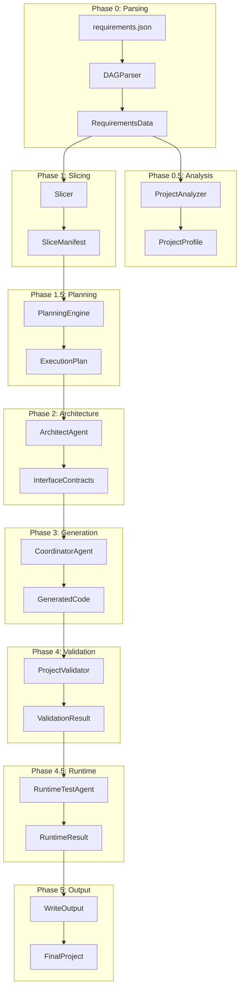
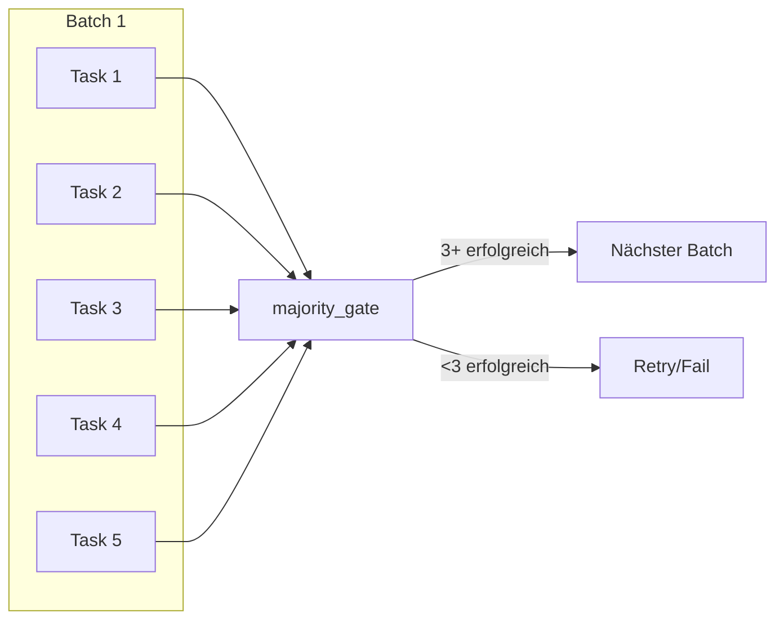
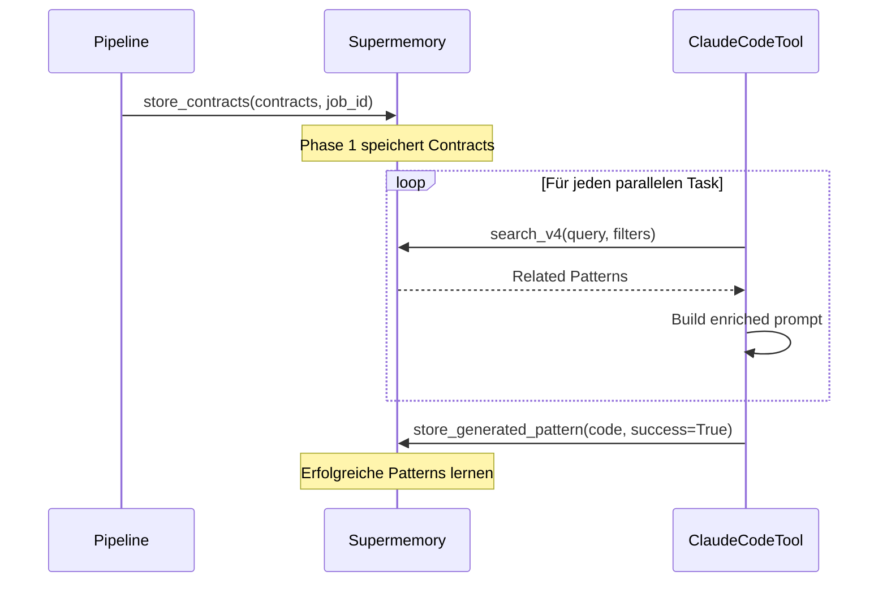
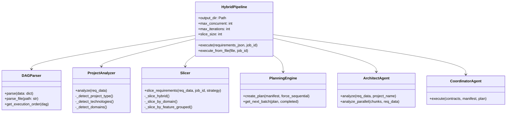

# Hybrid Run Architecture Analysis

> **Analysiert am:** 2025-12-02  
> **Status:** 6/6 Phasen erfolgreich

## Executive Summary

Die **Hybrid Pipeline** ist das Herzstück der Coding Engine - ein mehrstufiges, asynchrones System zur automatisierten Code-Generierung. Sie orchestriert 6 Phasen von der Requirements-Analyse bis zur Runtime-Validierung.



--- 

## 1. Einstiegspunkte

### 1.1 [`run_hybrid.py`](../run_hybrid.py)
Der primäre CLI-Einstiegspunkt für die Hybrid Pipeline.

**CLI-Optionen:**
| Option | Default | Beschreibung |
|--------|---------|--------------|
| `requirements_file` | (required) | Pfad zur JSON-Datei |
| `--output-dir` | `./output` | Ausgabeverzeichnis |
| `--job-id` | `1` | Job-Tracking-ID |
| `--max-concurrent` | `5` | Parallele CLI-Aufrufe |
| `--max-iterations` | `3` | Recovery-Iterationen |
| `--slice-size` | `3` | Requirements pro Slice |
| `--quiet` | `false` | Unterdrückt Progress-Output |

**Beispiel:**
```bash
python run_hybrid.py Data/requirements.json --output-dir ./output --max-iterations 5
```

### 1.2 [`src/engine/hybrid_pipeline.py`](../src/engine/hybrid_pipeline.py)
Die Kern-Pipeline-Klasse mit 938 Zeilen Code.

---

## 2. Pipeline-Phasen

### Phase 0: DAG Parsing
**Komponente:** [`DAGParser`](../src/engine/dag_parser.py)

```python
parser = DAGParser()
req_data = parser.parse_file("requirements.json")
# Returns: RequirementsData with nodes, edges, dag, requirement_groups
```

**Fähigkeiten:**
- Parst JSON zu `RequirementsData` Objekten
- Erstellt NetworkX DAG für Abhängigkeiten
- Inferiert Dependencies aus ID-Hierarchien (REQ-xxx-000-a → REQ-xxx-000)
- Gruppiert Requirements nach Tags (functional, performance, security, other)

### Phase 0.5: Project Analysis
**Komponente:** [`ProjectAnalyzer`](../src/engine/project_analyzer.py)

```python
analyzer = ProjectAnalyzer()
profile = analyzer.analyze(req_data)
# Returns: ProjectProfile with project_type, technologies, domains, complexity
```

**Erkannte Projekt-Typen:**
- `ELECTRON_APP`, `WEB_APP`, `API_SERVER`, `CLI_TOOL`
- `MOBILE_APP`, `DESKTOP_APP`, `GAME`, `LIBRARY`, `FULLSTACK`

**Technologie-Erkennung:**
- Frontend: React, Vue, Svelte, Angular
- Backend: FastAPI, Django, Express, NestJS, Flask
- Sprachen: TypeScript, Python, Rust, Go
- Datenbanken: PostgreSQL, MongoDB, SQLite, Redis

### Phase 1: Slicing
**Komponente:** [`Slicer`](../src/engine/slicer.py)

```python
slicer = Slicer()
manifest = slicer.slice_requirements(req_data, job_id=1, strategy="hybrid")
# Returns: SliceManifest with slices, total_requirements, agent_distribution
```

**Strategien:**
| Strategie | Beschreibung |
|-----------|--------------|
| `hybrid` | Kombiniert Depth- und Domain-Slicing |
| `domain` | Gruppiert nach Frontend/Backend/Database/Security |
| `feature_grouped` | Gruppiert zusammenhängende Features |
| `tech_stack` | Basiert auf definiertem Tech-Stack |

**Domain-Erkennung per Keyword:**
- **Frontend:** button, component, ui, css, react, chart, visualization
- **Backend:** api, endpoint, server, database, route
- **Database:** postgresql, mysql, mongodb, schema, migration
- **Security:** auth, token, encrypt, password, permission

### Phase 1.5: Planning
**Komponente:** [`PlanningEngine`](../src/engine/planning_engine.py)

```python
planner = PlanningEngine()
plan = planner.create_plan(manifest, force_sequential=True)
# Returns: ExecutionPlan with batches, estimated_time_ms
```

**Zeit-Schätzungen pro Slice:**
- Low Complexity: 30.000ms (30s)
- Medium Complexity: 60.000ms (1min)
- High Complexity: 120.000ms (2min)

### Phase 2: Architecture (Architect Agent)
**Komponente:** [`ArchitectAgent`](../src/agents/architect_agent.py)

```python
architect = ArchitectAgent(working_dir="./output")
contracts = await architect.analyze(req_data, project_name="MyProject")
# Returns: InterfaceContracts with types, endpoints, components, services
```

**Parallel-Modus:**
- Aktiviert bei >15 Requirements (`PARALLEL_THRESHOLD`)
- Analysiert Domain-Chunks parallel
- Merged Ergebnisse zu unified Contracts

### Phase 3: Generation (Coordinator Agent)
**Komponente:** [`CoordinatorAgent`](../src/agents/coordinator_agent.py)

```python
coordinator = CoordinatorAgent(
    working_dir="./output",
    max_concurrent=5,
    max_iterations=3
)
result = await coordinator.execute(contracts, manifest, plan)
# Returns: CoordinatorResult with files_generated, tests_passed, iterations
```

**Iterative Recovery:**
- Führt Tests nach jeder Generation aus
- Bei Fehlern: Analysiert Failures und generiert Fixes
- Maximal `max_iterations` Versuche

### Phase 4: Validation
**Komponente:** [`ProjectValidatorTool`](../src/tools/project_validator_tool.py)

```python
validator = ProjectValidatorTool(project_dir, profile=profile)
result = await validator.validate()
# Returns: ValidationResult with passed, error_count, warning_count, failures
```

**Dynamische Validator-Auswahl basierend auf Profile:**
- TypeScript-Projekte: `typescript` Validator
- Electron-Apps: `electron`, `build` Validators
- Python-APIs: `python` Validator

### Phase 4.5: Runtime Testing
**Komponenten:** 
- [`DeployTestTeam`](../src/agents/deploy_test_team.py) (bevorzugt)
- [`RuntimeTestAgent`](../src/agents/runtime_test_agent.py) (Fallback)

```python
team = DeployTestTeam(working_dir=project_dir, browser="chrome")
result = await team.run()
# Returns: TeamResult with console_errors, network_errors, fixes_successful
```

**Fähigkeiten:**
- Startet Dev-Server
- Öffnet Puppeteer/Chrome Browser
- Erfasst Console Logs und Network Errors
- Versucht automatische Fixes

### Phase 5: Output Writing
Schreibt finale Artefakte:
- `job_{id}/contracts.json` - Interface Contracts
- `job_{id}/manifest.json` - Build Manifest mit Profile
- `job_{id}/validation_report.json` - Bei Validation Failures
- `job_{id}/runtime_report.json` - Bei Runtime Errors

## 2.5 Parallel Batch Execution mit Async Gates (NEU: 2025-12-02)

### Komponente: [`AsyncGates`](../src/engine/async_gates.py)

Die parallele Ausführung nutzt **Async Gates** für robuste Batch-Verarbeitung:

```python
# Beispiel: Majority Gate (3 von 5 müssen erfolgreich sein)
from src.engine.async_gates import majority_gate

results = await majority_gate(
    tasks=[gen_task_1, gen_task_2, gen_task_3, gen_task_4, gen_task_5],
    required=3  # 3 von 5 müssen erfolgreich sein
)
```

**Gate-Strategien:**
| Gate | Beschreibung | Use Case |
|------|--------------|----------|
| `majority_gate` | 50%+1 der Tasks müssen erfolgen | Parallel Generation |
| `and_gate` | Alle Tasks müssen erfolgen | Kritische Validierungen |
| `or_gate` | Mindestens 1 Task muss erfolgen | Fallback-Szenarien |

### Batch-Verarbeitung



**Konfiguration:**
```bash
python run_hybrid.py requirements.json --max-concurrent 5
# Erzeugt 7 Batches bei 34 Slices (5 pro Batch, letzter Batch 4)
```

## 2.6 Supermemory Integration (NEU: 2025-12-02)

### Komponente: [`SupermemoryTools`](../src/tools/supermemory_tools.py)

Supermemory bietet persistente Memory für Kontext-Sharing zwischen parallelen Batches:



### API-Methoden

| Methode | Beschreibung |
|---------|--------------|
| `search_v4(query, filters)` | Speed-optimierte Suche mit AND/OR Filters |
| `add_document(content, containerTags)` | Dokument mit Container Tags speichern |
| `store_contracts(contracts, job_id)` | Phase 1 Contracts persistieren |
| `store_generated_pattern(code, domain, success)` | Erfolgreiche Code-Patterns lernen |
| `search_related_patterns(query, domain, job_id)` | Patterns für Context Loading |

### Container Tag Hierarchie

```
coding_engine_v1
├── job_123
│   ├── contracts
│   └── domain_backend
│       └── generated_pattern
└── job_124
    └── ...
```

### Konfiguration

```env
# .env
SUPERMEMORY_API_KEY=your-api-key
```

```python
# Automatisches Laden via python-dotenv
from dotenv import load_dotenv
load_dotenv()  # Lädt .env automatisch
```

---

## Bug Fixes - Feldnamen-Kompatibilität (2024-12-02)

### Problem
Die Codebase verwendete `req['id']` und `req['title']` hardcodiert, aber die `Data/requirements.json` Datei enthält `req_id` und `title` Felder.

### Betroffene Dateien

| Datei | Zeile(n) | Änderung |
|-------|----------|----------|
| [`src/agents/architect_agent.py`](../src/agents/architect_agent.py:149) | 149, 326 | `req.get("id") or req.get("req_id")` |
| [`src/agents/architect_agent.py`](../src/agents/architect_agent.py:344) | 344-346, 816-832 | F-String Syntax mit verdoppelten `{{}}` |
| [`src/agents/coordinator_agent.py`](../src/agents/coordinator_agent.py:493) | 493 | `r.get('id') or r.get('req_id')` und `r.get('title')` |
| [`src/engine/hybrid_pipeline.py`](../src/engine/hybrid_pipeline.py:527) | 527, 583 | `req.get("id") or req.get("req_id")` |
| [`src/autogen/orchestrator.py`](../src/autogen/orchestrator.py:216) | 216 | `r.get('id') or r.get('req_id')` und `r.get('title')` |
| [`src/engine/project_context.py`](../src/engine/project_context.py:191) | 191 | `req.get('id') or req.get('req_id')` und `req.get('title')` |

### Lösung
Alle direkten Dictionary-Zugriffe wurden durch `.get()` mit Fallback ersetzt:
```python
# Vorher
f"- [{r['id']}] {r['title']}"

# Nachher
f"- [{r.get('id') or r.get('req_id', '')}] {r.get('title', r.get('description', ''))}"
```

### Verifizierung
```bash
python -c "from src.engine.hybrid_pipeline import HybridPipeline; ..."  # ✓ Erfolgreich
```

---

## 3. Datenstrukturen

### RequirementsData
```python
@dataclass
class RequirementsData:
    success: bool
    workflow_status: str
    requirements: list[dict]      # Raw requirements
    nodes: list[DAGNode]          # Parsed nodes
    edges: list[DAGEdge]          # Dependency edges
    summary: dict
    dag: Optional[nx.DiGraph]     # NetworkX DAG
    requirement_groups: dict      # By tag grouping
```

### ProjectProfile
```python
@dataclass
class ProjectProfile:
    project_type: ProjectType
    technologies: list[Technology]
    platforms: list[str]          # windows, macos, linux, web
    domains: list[Domain]
    complexity: str               # simple, medium, complex
    primary_language: str
    has_backend: bool
    has_frontend: bool
    has_database: bool
```

### SliceManifest
```python
@dataclass
class SliceManifest:
    job_id: int
    total_slices: int
    total_requirements: int
    slices: list[TaskSlice]
    agent_distribution: dict[str, int]
    max_depth: int
```

### ExecutionPlan
```python
@dataclass
class ExecutionPlan:
    job_id: int
    total_batches: int
    batches: list[ExecutionBatch]
    sequential_only: bool
```

---

## 4. E2E Test-Ergebnisse

### Test-Suite: [`tests/e2e/test_pipeline_dataflow.py`](../tests/e2e/test_pipeline_dataflow.py)

| Test | Status | Ergebnis |
|------|--------|----------|
| Phase 0: DAG Parsing | ✅ | 3 Nodes, 3 Requirements |
| Phase 0.5: Analysis | ✅ | Type: API_SERVER, 6 Domains, Complexity: simple |
| Phase 1: Slicing | ✅ | 3 Slices mit hybrid Strategy |
| Phase 1.5: Planning | ✅ | 3 Batches, 90.000ms geschätzt |
| E2E-5: Slicer Strategien | ✅ | hybrid/domain/feature_grouped alle OK |
| E2E-6: Feature-Erkennung | ✅ | Frontend/API/Database korrekt erkannt |

**Gesamt:** Alle 6 Tests erfolgreich in **5.827ms**

---

## 5. Konfiguration

### Umgebungsvariablen
```env
# .env
ANTHROPIC_API_KEY=sk-ant-...
SUPERMEMORY_API_KEY=...
SUPERMEMORY_CONTAINER_ID=...
```

### Pipeline-Konstanten
```python
# hybrid_pipeline.py
PARALLEL_THRESHOLD = 15  # Requirements für Parallel-Analyse

# planning_engine.py
TIME_ESTIMATES = {
    "low": 30000,
    "medium": 60000,
    "high": 120000,
}
```

---

## 6. Architektur-Diagramm



---

## 7. Bekannte Issues und Verbesserungen

### Offene Punkte
| ID | Beschreibung | Priorität |
|----|--------------|-----------|
| E2E-7 | Fehlerbehandlung bei ungültigen Eingaben | Medium |
| E2E-8 | Ressourcenmanagement und Cleanup | Medium |
| FIX-30 | FileLocationAgent - Frontend/Backend Trennung | High |
| ARCH-44 | OpenTelemetry für Conversation Tracing | Low |

### Beobachtungen aus Tests
1. **Leere Requirements:** Pipeline läuft trotzdem durch (sollte früh abbrechen)
2. **Domain vs Backend:** `_detect_domain()` gibt `Domain.API` zurück, nicht `BACKEND`
3. **Memory Usage:** Keine explizite Ressourcen-Freigabe nach Pipeline-Ende

---

## 8. Verwendung

### Minimal-Beispiel
```python
import asyncio
from src.engine.hybrid_pipeline import HybridPipeline

async def main():
    pipeline = HybridPipeline(
        output_dir="./output",
        max_concurrent=5,
        max_iterations=3,
    )
    
    result = await pipeline.execute_from_file(
        "Data/requirements.json",
        job_id=42
    )
    
    print(f"Success: {result.success}")
    print(f"Files: {result.files_generated}")

asyncio.run(main())
```

### Mit Progress Callback
```python
def on_progress(progress):
    print(f"[{progress.phase}] {progress.current_phase}/{progress.total_phases}")

pipeline = HybridPipeline(
    output_dir="./output",
    progress_callback=on_progress
)
```

---

## 9. Zusammenfassung

Die Hybrid Pipeline ist eine robuste, erweiterbare Code-Generierungs-Engine mit:

- ✅ **6 klar definierte Phasen**
- ✅ **Dynamische Projekt-Erkennung**
- ✅ **3 Slicing-Strategien**
- ✅ **Parallel-Analyse für große Projekte**
- ✅ **Iterative Recovery mit max 3 Versuchen**
- ✅ **Validation + Runtime Testing**
- ✅ **Umfassende E2E-Tests bestanden**

---
*Last updated: 2024-12-11*
*Analysis based on Fixes A-H implementation*