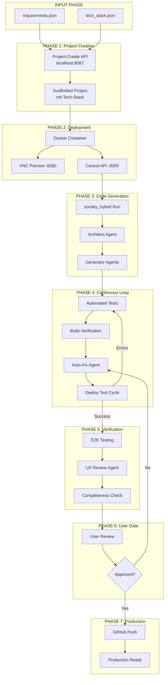
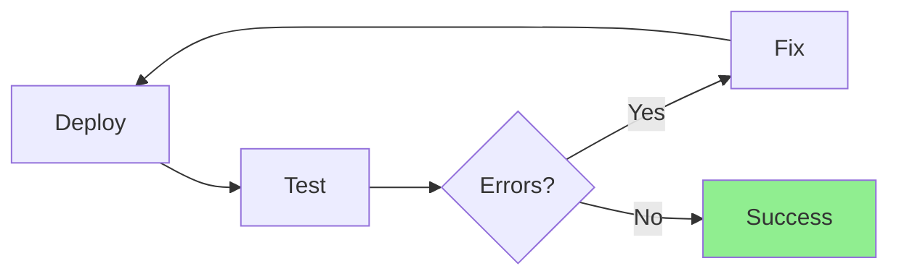
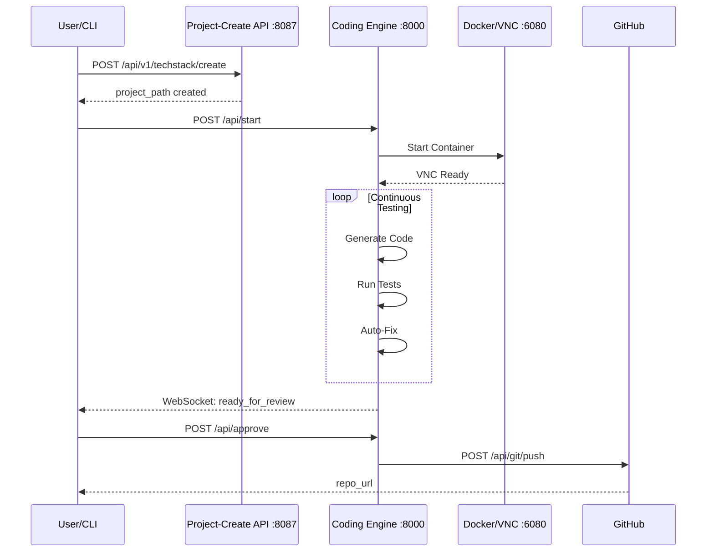

# 🎯 End-to-End Code Generation Orchestrator

## Übersicht

Dieser Plan beschreibt den vollständigen autonomen Workflow von Requirements bis Production.

## System-Architektur



## Detaillierte Phasen

### Phase 1: Project Creation via External API

**Endpoint:** `POST http://localhost:8087/api/v1/techstack/create`

```json
{
  "template_id": "01-web-app",
  "project_name": "generated-app",
  "output_path": "/workspace/output",
  "requirements": [/* from requirements.json */]
}
```

**Response:**
```json
{
  "success": true,
  "path": "/workspace/output/generated-app",
  "files_created": 15
}
```

**Was wird erstellt:**
- Komplettes Projekt-Scaffold basierend auf tech_stack.json
- package.json / requirements.txt
- Basis-Verzeichnisstruktur
- Config-Dateien (vite.config.ts, tsconfig.json, etc.)

---

### Phase 2: Deployment Infrastructure

**Docker Container starten:**
```bash
cd infra && docker-compose up --build
```

**Services:**
| Port | Service | Beschreibung |
|------|---------|--------------|
| 8000 | Control API | FastAPI für Engine-Steuerung |
| 6080 | VNC | Live Preview im Browser |
| 3000 | Preview | React/Next.js App |

---

### Phase 3: Initial Code Generation

**Empfehlung:** `society_hybrid` für ersten Run (nicht `hybrid`)

**Gründe:**
- Enthält Project Scaffolding (Phase 0)
- Continuous Testing Loop eingebaut
- Completeness Checker
- Autonomous Mode bis 100%

**Befehl:**
```bash
python run_society_hybrid.py Data/requirements.json \
  --output-dir /workspace/output/generated-app \
  --autonomous \
  --continuous-sandbox \
  --enable-vnc
```

---

### Phase 4: Continuous Testing Loop



**30-Sekunden-Zyklus:**
1. Build starten
2. Tests ausführen
3. Errors sammeln
4. Auto-Fix Agent korrigiert
5. Wiederholen bis 0 Errors

---

### Phase 5: Autonomous Verification

**Checks:**
- [ ] Alle Tests grün
- [ ] Build erfolgreich
- [ ] 0 Type Errors
- [ ] 0 Lint Errors
- [ ] Completeness Score >= 90%
- [ ] E2E Tests bestanden

---

### Phase 6: User Review Gate

**Vor Production:**
1. Notification an User
2. Preview-URL bereitstellen
3. Manuelle Prüfung ermöglichen
4. Approval Button im Widget

---

### Phase 7: Production Deployment

**Git Push:**
```bash
curl -X POST http://localhost:8000/api/git/push \
  -H "Content-Type: application/json" \
  -d '{"repo_name": "my-app", "private": true}'
```

---

## API-Flow Sequenzdiagramm



---

## 🎯 7-Phase Workflow

## Offene Fragen

1. **Orchestrator-Service:**
   - Soll ein neuer Service die Phasen koordinieren?
   - Oder reicht ein Shell-Skript?

2. **User Gate Implementation:**
   - WebSocket Notification?
   - Widget Approval Button?
   - CLI Prompt?

3. **Rollback-Strategie:**
   - Bei Fehlschlag zurückrollen?
   - Intermediate States speichern?

## 🚀 Nutzung

### Quick Start

```bash
# Vollständige Pipeline mit User-Review
python run_orchestrator.py Data/requirements.json Data/tech_stack.json

# Auto-Modus ohne Benutzerinteraktion
python run_orchestrator.py Data/requirements.json Data/tech_stack.json --auto-approve

# Docker bereits gestartet
python run_orchestrator.py Data/requirements.json Data/tech_stack.json --no-docker

# Eigener Projektname
python run_orchestrator.py Data/requirements.json Data/tech_stack.json --project mein-projekt
```

### CLI Optionen

| Option | Default | Beschreibung |
|--------|---------|--------------|
| `--project, -p` | `generated-app` | Projektname für Output und Git |
| `--output-dir, -o` | `./output` | Ausgabeverzeichnis |
| `--mode` | `society_hybrid` | `hybrid` oder `society_hybrid` |
| `--auto-approve` | `false` | Überspringe User Review Gate |
| `--no-docker` | `false` | Docker nicht starten |
| `--no-git` | `false` | Git Push überspringen |
| `--max-time` | `3600` | Max. Laufzeit Code Generation (Sekunden) |
| `--vnc-port` | `6080` | VNC Preview Port |

### Beispiel-Output

```
============================================================
🎯 END-TO-END CODE GENERATION ORCHESTRATOR
============================================================
  Started: 2025-11-30T12:30:00
  Requirements: Data/requirements.json
  Tech Stack: Data/tech_stack.json
  Output: ./output/generated-app
  Mode: society_hybrid
============================================================

============================================================
📁 PHASE 1: PROJECT CREATION
============================================================
  API: http://localhost:8087/api/v1/techstack/create
  Template: 01-web-app
  Project: generated-app
  
  ✅ Project created at: ./output/generated-app
  📄 Files created: 15

============================================================
🐳 PHASE 2: DEPLOYMENT INFRASTRUCTURE
============================================================
  Starting docker-compose...
  ✅ Control API ready at http://localhost:8000
  🖥️  VNC Preview: http://localhost:6080/vnc.html

...

============================================================
📊 ORCHESTRATION SUMMARY
============================================================
  ✅ create_project: Project created with 15 files (2.1s)
  ✅ start_docker: Docker services started (45.3s)
  ✅ generate_code: Code generation completed (1823.5s)
  ✅ testing_loop: Tests passed (0.0s)
  ✅ verification: Verification complete (0.5s)
  ✅ user_review: User approved (12.0s)
  ✅ git_push: Pushed to https://github.com/user/generated-app (8.2s)
------------------------------------------------------------
  Total Time: 1891.6s (31.5 min)
  Final Status: SUCCESS
============================================================
```

---

## 📂 Implementation

### Hauptdatei

- **[`run_orchestrator.py`](../run_orchestrator.py)** - Orchestrator-Skript mit allen 7 Phasen

### Abhängigkeiten

```python
# requirements.txt
httpx>=0.24.0  # Async HTTP Client für API Calls
```

### Phasen-Funktionen

| Phase | Funktion | Beschreibung |
|-------|----------|--------------|
| 1 | `phase_create_project()` | Project-Create API Call |
| 2 | `phase_start_docker()` | Docker-Compose Up |
| 3 | `phase_generate_code()` | society_hybrid/hybrid Runner |
| 4 | `phase_testing_loop()` | Continuous Sandbox Test |
| 5 | `phase_verification()` | Quality Checks |
| 6 | `phase_user_review()` | User Approval Gate |
| 7 | `phase_git_push()` | GitHub Push |

### Konfiguration

```python
@dataclass
class OrchestratorConfig:
    # Input
    requirements_file: str
    tech_stack_file: str
    
    # Output
    project_name: str = "generated-app"
    output_dir: str = "./output"
    
    # APIs
    project_create_api: str = "http://localhost:8087"
    coding_engine_api: str = "http://localhost:8000"
    
    # Code Generation
    run_mode: str = "society_hybrid"
    max_time: int = 3600
    
    # User Gate
    auto_approve: bool = False
    
    # Git
    git_push: bool = True
    github_token: Optional[str] = os.getenv("GITHUB_TOKEN")
```