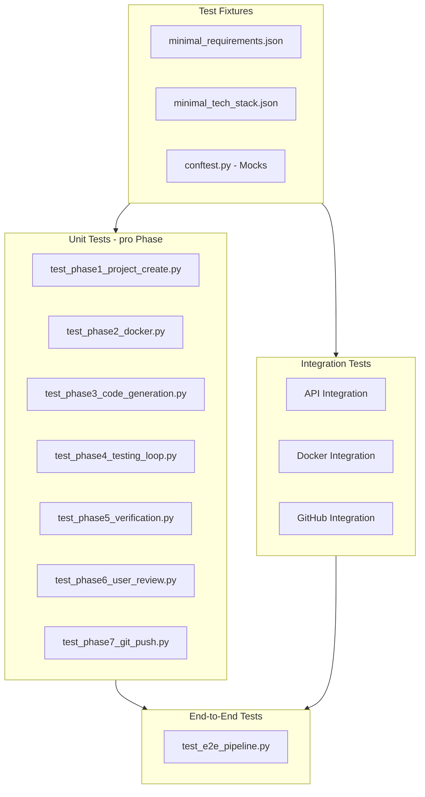
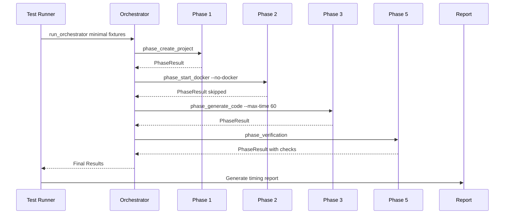

# 🧪 Orchestrator Test Plan

## Übersicht

Dieser Testplan definiert die vollständige Teststrategie für den 7-Phasen Code Generation Orchestrator.

## Test-Architektur



---

## Verzeichnisstruktur

```
tests/
└── orchestrator/
    ├── __init__.py
    ├── conftest.py                    # Fixtures, Mocks, Test-Konfiguration
    ├── fixtures/
    │   ├── minimal_requirements.json  # Minimale Test-Requirements
    │   ├── minimal_tech_stack.json    # Minimaler Tech-Stack
    │   └── mock_responses.py          # Mock API Responses
    ├── unit/
    │   ├── test_phase1_project_create.py
    │   ├── test_phase2_docker.py
    │   ├── test_phase3_code_generation.py
    │   ├── test_phase4_testing_loop.py
    │   ├── test_phase5_verification.py
    │   ├── test_phase6_user_review.py
    │   └── test_phase7_git_push.py
    ├── integration/
    │   ├── test_project_create_api.py
    │   ├── test_coding_engine_api.py
    │   └── test_github_api.py
    └── e2e/
        └── test_e2e_pipeline.py
```

---

## Phase 1: Project Creation Tests

### Unit Tests (`test_phase1_project_create.py`)

| Test ID | Test Name | Beschreibung | Mock | Erwartetes Ergebnis |
|---------|-----------|--------------|------|---------------------|
| P1-U01 | `test_load_requirements_success` | Lädt gültige requirements.json | Filesystem | PhaseResult.success=True |
| P1-U02 | `test_load_requirements_file_not_found` | File nicht vorhanden | Filesystem | PhaseResult.success=False, Fehlermeldung |
| P1-U03 | `test_load_requirements_invalid_json` | Ungültiges JSON | Filesystem | PhaseResult.success=False |
| P1-U04 | `test_load_tech_stack_success` | Lädt gültige tech_stack.json | Filesystem | PhaseResult.success=True |
| P1-U05 | `test_api_call_success` | API gibt success=true zurück | httpx | PhaseResult mit project_path |
| P1-U06 | `test_api_call_failure` | API gibt success=false zurück | httpx | PhaseResult.success=False |
| P1-U07 | `test_api_connection_error` | API nicht erreichbar | httpx | PhaseResult mit ConnectError Message |
| P1-U08 | `test_api_timeout` | API Timeout | httpx | PhaseResult.success=False, Timeout-Meldung |

### Integration Tests

| Test ID | Test Name | Voraussetzung | Beschreibung |
|---------|-----------|---------------|--------------|
| P1-I01 | `test_project_create_api_health` | API auf :8087 | GET /health → 200 |
| P1-I02 | `test_create_minimal_project` | API auf :8087 | POST mit minimal_requirements.json |
| P1-I03 | `test_create_with_invalid_template` | API auf :8087 | POST mit unbekanntem template_id |

### Fehlerszenarien

```python
# Mock für ConnectError
@pytest.fixture
def mock_api_unavailable():
    with patch('httpx.AsyncClient.post') as mock:
        mock.side_effect = httpx.ConnectError("Connection refused")
        yield mock

# Mock für Timeout
@pytest.fixture
def mock_api_timeout():
    with patch('httpx.AsyncClient.post') as mock:
        mock.side_effect = httpx.TimeoutException("Timeout")
        yield mock
```

---

## Phase 2: Docker Deployment Tests

### Unit Tests (`test_phase2_docker.py`)

| Test ID | Test Name | Beschreibung | Mock | Erwartetes Ergebnis |
|---------|-----------|--------------|------|---------------------|
| P2-U01 | `test_skip_docker_when_disabled` | --no-docker Flag | None | PhaseResult.success=True, message=skipped |
| P2-U02 | `test_compose_file_not_found` | docker-compose.yml fehlt | Filesystem | PhaseResult.success=False |
| P2-U03 | `test_docker_compose_up_success` | compose up erfolgreich | subprocess | PhaseResult.success=True |
| P2-U04 | `test_docker_compose_up_failure` | compose up schlägt fehl | subprocess | PhaseResult.success=False |
| P2-U05 | `test_health_check_success` | Health API antwortet | httpx | PhaseResult.success=True |
| P2-U06 | `test_health_check_timeout` | Health API antwortet nicht | httpx | PhaseResult.success=False |
| P2-U07 | `test_docker_not_installed` | docker-compose nicht gefunden | subprocess | FileNotFoundError Message |

### Integration Tests

| Test ID | Test Name | Voraussetzung | Beschreibung |
|---------|-----------|---------------|--------------|
| P2-I01 | `test_docker_compose_syntax` | Docker installed | docker-compose config -q |
| P2-I02 | `test_containers_start` | Docker running | docker-compose up -d |
| P2-I03 | `test_vnc_accessible` | Container running | HTTP GET localhost:6080 |

### Fehlerszenarien

```python
# Mock für subprocess.TimeoutExpired
@pytest.fixture
def mock_docker_timeout():
    with patch('subprocess.Popen') as mock:
        mock.return_value.communicate.side_effect = subprocess.TimeoutExpired(cmd="docker", timeout=300)
        yield mock
```

---

## Phase 3: Code Generation Tests

### Unit Tests (`test_phase3_code_generation.py`)

| Test ID | Test Name | Beschreibung | Mock | Erwartetes Ergebnis |
|---------|-----------|--------------|------|---------------------|
| P3-U01 | `test_runner_script_not_found` | run_society_hybrid.py fehlt | Filesystem | PhaseResult.success=False |
| P3-U02 | `test_command_building_hybrid` | Korrekte Argumente für hybrid | None | cmd enthält erwartete Args |
| P3-U03 | `test_command_building_society` | Korrekte Argumente für society_hybrid | None | cmd enthält --autonomous |
| P3-U04 | `test_generation_success` | Exit code 0 | subprocess | PhaseResult.success=True |
| P3-U05 | `test_generation_failure` | Exit code != 0 | subprocess | PhaseResult.success=False |
| P3-U06 | `test_generation_exception` | Exception während subprocess | subprocess | PhaseResult.success=False |

### Fehlerszenarien

```python
# Mock für fehlgeschlagene Code Generation
@pytest.fixture
def mock_code_gen_failure():
    with patch('subprocess.Popen') as mock:
        mock.return_value.wait.return_value = 1  # Non-zero exit
        mock.return_value.stdout = iter(["Error during generation\n"])
        yield mock
```

---

## Phase 4: Testing Loop Tests

### Unit Tests (`test_phase4_testing_loop.py`)

| Test ID | Test Name | Beschreibung | Mock | Erwartetes Ergebnis |
|---------|-----------|--------------|------|---------------------|
| P4-U01 | `test_status_api_success` | API gibt state=completed | httpx | PhaseResult.success=True |
| P4-U02 | `test_status_api_in_progress` | API gibt state=running | httpx | PhaseResult.success=False |
| P4-U03 | `test_status_api_unreachable` | API nicht erreichbar | httpx | PhaseResult.success=True (fallback) |
| P4-U04 | `test_inline_with_generation` | Kein separater API Call nötig | None | Default success |

---

## Phase 5: Verification Tests

### Unit Tests (`test_phase5_verification.py`)

| Test ID | Test Name | Beschreibung | Setup | Erwartetes Ergebnis |
|---------|-----------|--------------|-------|---------------------|
| P5-U01 | `test_project_exists` | Verzeichnis existiert | tmp_path | checks[project_exists]=True |
| P5-U02 | `test_project_missing` | Verzeichnis fehlt | None | PhaseResult.success=False |
| P5-U03 | `test_package_json_found` | package.json vorhanden | tmp_path + file | checks[has_package]=True |
| P5-U04 | `test_requirements_txt_found` | requirements.txt vorhanden | tmp_path + file | checks[has_package]=True |
| P5-U05 | `test_no_dependency_file` | Keine Dependency-Datei | tmp_path | checks[has_package]=False |
| P5-U06 | `test_source_files_found` | .ts/.py Dateien vorhanden | tmp_path + files | checks[has_source]=True |
| P5-U07 | `test_no_source_files` | Keine Source-Dateien | tmp_path | checks[has_source]=False |
| P5-U08 | `test_build_artifacts_exist` | node_modules/dist vorhanden | tmp_path + dirs | checks[build_artifacts]=True |
| P5-U09 | `test_overall_success_criteria` | project + source files | tmp_path + files | PhaseResult.success=True |

### Validierungskriterien

```python
SUCCESS_CRITERIA = {
    "required": ["project_exists", "has_source_files"],
    "optional": ["has_package_json_or_requirements", "build_artifacts_exist"],
}
```

---

## Phase 6: User Review Tests

### Unit Tests (`test_phase6_user_review.py`)

| Test ID | Test Name | Beschreibung | Mock | Erwartetes Ergebnis |
|---------|-----------|--------------|------|---------------------|
| P6-U01 | `test_auto_approve_enabled` | --auto-approve Flag | None | PhaseResult.success=True, skipped |
| P6-U02 | `test_user_approves` | User gibt 'y' ein | input() | PhaseResult.success=True |
| P6-U03 | `test_user_rejects` | User gibt 'n' ein | input() | PhaseResult.success=False |
| P6-U04 | `test_user_reviews` | User gibt 'r' ein | input(), subprocess | Calls startfile/open |
| P6-U05 | `test_invalid_input_retry` | User gibt ungültige Eingabe | input() | Fragt erneut |

### Mock für User Input

```python
@pytest.fixture
def mock_user_input_approve():
    with patch('builtins.input', return_value='y'):
        yield

@pytest.fixture
def mock_user_input_reject():
    with patch('builtins.input', return_value='n'):
        yield
```

---

## Phase 7: Git Push Tests

### Unit Tests (`test_phase7_git_push.py`)

| Test ID | Test Name | Beschreibung | Mock | Erwartetes Ergebnis |
|---------|-----------|--------------|------|---------------------|
| P7-U01 | `test_git_push_disabled` | --no-git Flag | None | PhaseResult.success=True, skipped |
| P7-U02 | `test_no_github_token` | GITHUB_TOKEN nicht gesetzt | env | PhaseResult.success=True, skipped |
| P7-U03 | `test_push_success` | API gibt repo_url zurück | httpx | PhaseResult.success=True, data[repo_url] |
| P7-U04 | `test_push_failure` | API gibt 4xx/5xx | httpx | PhaseResult.success=False |
| P7-U05 | `test_push_exception` | Exception während API Call | httpx | PhaseResult.success=False |

### Integration Tests

| Test ID | Test Name | Voraussetzung | Beschreibung |
|---------|-----------|---------------|--------------|
| P7-I01 | `test_github_token_valid` | GITHUB_TOKEN gesetzt | Validiere Token gegen GitHub API |
| P7-I02 | `test_create_private_repo` | GITHUB_TOKEN + API | Erstelle Test-Repo (und lösche) |

---

## End-to-End Tests

### Test Pipeline (`test_e2e_pipeline.py`)

```python
@pytest.mark.e2e
class TestOrchestratorE2E:
    """
    End-to-End Tests für die komplette 7-Phasen Pipeline.
    Benötigt:
    - Project-Create API auf localhost:8087
    - Docker installiert und laufend
    - GITHUB_TOKEN gesetzt (optional)
    """
    
    def test_full_pipeline_auto_approve(self):
        """Kompletter Durchlauf mit --auto-approve --no-git"""
        
    def test_pipeline_phase_transitions(self):
        """Validiert Datenfluss zwischen Phasen"""
        
    def test_pipeline_failure_recovery(self):
        """Prüft Verhalten bei Fehler in Phase 3"""
        
    def test_pipeline_timing_report(self):
        """Generiert Timing-Bericht pro Phase"""
        
    def test_rollback_on_late_failure(self):
        """Prüft Rollback wenn Phase 6 fehlschlägt"""
```

### E2E Test Scenario



### Timing Report Format

```json
{
  "timestamp": "2025-11-30T12:00:00Z",
  "total_duration_seconds": 125.5,
  "phases": [
    {
      "name": "create_project",
      "success": true,
      "duration": 2.1,
      "message": "Project created"
    },
    {
      "name": "start_docker",
      "success": true,
      "duration": 0.0,
      "message": "Skipped"
    }
  ],
  "final_status": "SUCCESS"
}
```

---

## Test Fixtures

### minimal_requirements.json

```json
{
  "project": "test-app",
  "requirements": [
    {
      "id": "REQ-001",
      "title": "Hello World Page",
      "description": "Display Hello World on main page",
      "priority": "HIGH",
      "type": "functional"
    }
  ]
}
```

### minimal_tech_stack.json

```json
{
  "tech_stack": {
    "id": "01-web-app",
    "name": "Simple Web App",
    "framework": "vanilla",
    "language": "typescript"
  }
}
```

---

## conftest.py - Shared Fixtures

```python
import pytest
from pathlib import Path
from unittest.mock import patch, MagicMock
import httpx

# ============================================
# Path Fixtures
# ============================================

@pytest.fixture
def fixtures_dir():
    return Path(__file__).parent / "fixtures"

@pytest.fixture
def minimal_requirements(fixtures_dir):
    return fixtures_dir / "minimal_requirements.json"

@pytest.fixture
def minimal_tech_stack(fixtures_dir):
    return fixtures_dir / "minimal_tech_stack.json"

# ============================================
# Config Fixtures
# ============================================

@pytest.fixture
def orchestrator_config(minimal_requirements, minimal_tech_stack, tmp_path):
    from run_orchestrator import OrchestratorConfig
    return OrchestratorConfig(
        requirements_file=str(minimal_requirements),
        tech_stack_file=str(minimal_tech_stack),
        project_name="test-project",
        output_dir=str(tmp_path),
        auto_approve=True,
        start_docker=False,
        git_push=False,
        max_time=60,
    )

# ============================================
# Mock Fixtures
# ============================================

@pytest.fixture
def mock_httpx_success():
    with patch('httpx.AsyncClient') as mock:
        mock_response = MagicMock()
        mock_response.status_code = 200
        mock_response.json.return_value = {"success": True, "path": "/test/path", "files_created": 5}
        mock.return_value.__aenter__.return_value.post.return_value = mock_response
        yield mock

@pytest.fixture
def mock_httpx_connection_error():
    with patch('httpx.AsyncClient') as mock:
        mock.return_value.__aenter__.return_value.post.side_effect = httpx.ConnectError("Connection refused")
        yield mock

@pytest.fixture
def mock_subprocess_success():
    with patch('subprocess.Popen') as mock:
        process_mock = MagicMock()
        process_mock.returncode = 0
        process_mock.communicate.return_value = (b"Success", b"")
        process_mock.stdout = iter([])
        process_mock.wait.return_value = 0
        mock.return_value = process_mock
        yield mock

@pytest.fixture
def mock_subprocess_failure():
    with patch('subprocess.Popen') as mock:
        process_mock = MagicMock()
        process_mock.returncode = 1
        process_mock.communicate.return_value = (b"", b"Error")
        mock.return_value = process_mock
        yield mock

# ============================================
# Project Structure Fixtures
# ============================================

@pytest.fixture
def mock_project_structure(tmp_path):
    """Erstellt minimale Projektstruktur für Verification Tests."""
    project = tmp_path / "test-project"
    project.mkdir()
    
    # package.json
    (project / "package.json").write_text('{"name": "test"}')
    
    # Source files
    src = project / "src"
    src.mkdir()
    (src / "index.ts").write_text('console.log("hello")')
    
    return project
```

---

## Ausführung

### Alle Unit Tests

```bash
pytest tests/orchestrator/unit/ -v
```

### Nur Phase 1 Tests

```bash
pytest tests/orchestrator/unit/test_phase1_project_create.py -v
```

### Integration Tests (benötigt laufende Services)

```bash
pytest tests/orchestrator/integration/ -v -m integration
```

### End-to-End Tests

```bash
pytest tests/orchestrator/e2e/ -v -m e2e --tb=short
```

### Mit Coverage Report

```bash
pytest tests/orchestrator/ --cov=run_orchestrator --cov-report=html
```

### Test Report Generierung

```bash
pytest tests/orchestrator/ --json-report --json-report-file=test_report.json
```

---

## CI/CD Integration

```yaml
# .github/workflows/test-orchestrator.yml
name: Orchestrator Tests

on: [push, pull_request]

jobs:
  unit-tests:
    runs-on: ubuntu-latest
    steps:
      - uses: actions/checkout@v4
      - uses: actions/setup-python@v5
        with:
          python-version: '3.11'
      - run: pip install -r requirements.txt pytest pytest-asyncio pytest-cov
      - run: pytest tests/orchestrator/unit/ -v --cov=run_orchestrator

  integration-tests:
    runs-on: ubuntu-latest
    needs: unit-tests
    steps:
      - uses: actions/checkout@v4
      - uses: actions/setup-python@v5
      - run: docker-compose -f infra/docker-compose.yml up -d
      - run: pytest tests/orchestrator/integration/ -v -m integration
```