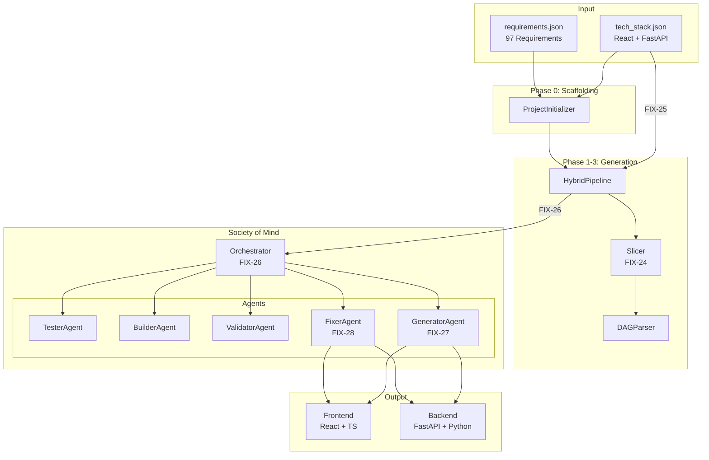

# Testlauf & Monitoring Plan: Society of Mind mit TechStack

## 1. Testlauf-Konfiguration

### Testbefehl
```bash
python run_society_hybrid.py Data/requirements.json \
    --tech-stack Data/tech_stack.json \
    --output-dir ./output_techstack_test \
    --autonomous \
    --max-concurrent 3 \
    --verbose
```

### Alternative: Kürzerer Fast-Test
```bash
python run_society_hybrid.py Data/requirements.json \
    --tech-stack Data/tech_stack.json \
    --output-dir ./output_fast_test \
    --fast \
    --max-time 600 \
    --max-iterations 20
```

### Projekt-Details
| Parameter | Wert |
|-----------|------|
| Requirements | 97 Anforderungen |
| Projekt-Typ | Process/Port Monitoring Web-Dashboard |
| Frontend | React + TypeScript |
| Backend | FastAPI + Python |
| Database | PostgreSQL |
| Deployment | Docker |

---

## 2. Monitoring-Checkliste während der Laufzeit

### Phase 0: Scaffolding [0-30 Sekunden]

#### ✅ Erfolgs-Indikatoren
- [ ] `Project Type: detected correctly` in Console
- [ ] `Files Created: >10` Dateien
- [ ] `Dependencies Installed: Yes` erscheint
- [ ] `Status: SUCCESS` für Scaffolding

#### ❌ Fehler-Indikatoren
- [ ] `Error: npm install failed`
- [ ] `Status: FAILED` für Scaffolding
- [ ] Missing package.json oder requirements.txt

---

### Phase 1-3: Code Generation + Society of Mind [1-30 Minuten]

#### 🔍 Slicer-Monitoring (FIX-24, FIX-25)
Achte auf Log-Einträge wie:
```
[info] slice_created    slice_type=frontend ...
[info] slice_created    slice_type=backend ...
[info] slice_created    slice_type=shared ...
```

**Kritische Fragen:**
- [ ] Werden Frontend-Slices erstellt? (React/TypeScript Files)
- [ ] Werden Backend-Slices erstellt? (FastAPI/Python Files)
- [ ] Ist die Trennung sauber? (Keine gemischten Slices)

#### 🔍 TechStack-Propagation (FIX-26, FIX-27, FIX-28)
Achte auf Log-Einträge wie:
```
[info] tech_stack_configured    frontend=React backend=FastAPI platform=Docker
```

**Kritische Checkpoints:**
- [ ] TechStack wird in HybridPipeline geladen
- [ ] TechStack wird an Orchestrator übergeben
- [ ] TechStack wird an GeneratorAgent übergeben
- [ ] TechStack wird an FixerAgent übergeben

#### 🔍 Agent-Aktivitäten
| Agent | Erwartete Aktivität |
|-------|---------------------|
| Tester | Tests ausführen, Ergebnisse melden |
| Builder | Build-Prozess (npm build / pytest) |
| Validator | TypeScript/Linting Fehler prüfen |
| Fixer | Fehler beheben mit Claude |
| Generator | Code generieren basierend auf Events |

---

### Convergence-Metriken [Kontinuierlich überwachen]

#### Progress-Anzeige Format:
```
[XX.X%] Iter:XXX | Tests:XX/XX (XX.X%) | Build:OK | Errors: V:X T:X | Confidence:XX%
```

#### 📊 Metriken-Bedeutung:
| Metrik | Bedeutung | Zielwert |
|--------|-----------|----------|
| `Tests` | Bestandene/Gesamt Tests | >90% |
| `Build` | Build-Status | OK |
| `V:X` | Validation Errors | 0 |
| `T:X` | Type Errors | 0 |
| `Confidence` | System-Confidence | >95% |

#### 🚦 Ampel-System:
- 🟢 **Grün**: Confidence >80%, Tests >80%, Build OK
- 🟡 **Gelb**: Confidence 50-80%, einige Fehler
- 🔴 **Rot**: Confidence <50%, Build FAIL, viele Fehler

---

## 3. Spezifische TechStack-Tests

### Frontend-Generierung (React + TypeScript)
Prüfe ob folgende Dateien erstellt werden:

```
output_techstack_test/
├── src/
│   ├── components/       # ✓ React Komponenten
│   ├── pages/           # ✓ Page Components
│   ├── hooks/           # ✓ Custom Hooks
│   ├── types/           # ✓ TypeScript Interfaces
│   └── App.tsx          # ✓ Main App
├── package.json         # ✓ Dependencies
├── tsconfig.json        # ✓ TS Config
└── vite.config.ts       # ✓ Build Config
```

### Backend-Generierung (FastAPI + Python)
Prüfe ob folgende Dateien erstellt werden:

```
output_techstack_test/
├── src/
│   ├── api/             # ✓ FastAPI Routes
│   │   ├── main.py      # ✓ FastAPI App
│   │   └── routes/      # ✓ API Endpoints
│   ├── services/        # ✓ Business Logic
│   └── models/          # ✓ Pydantic Models
├── requirements.txt     # ✓ Python Dependencies
└── start_server.py      # ✓ Server Entrypoint
```

---

## 4. Fehler-Eskalation & Recovery

### Häufige Fehler und Lösungen

| Fehler | Ursache | Lösung |
|--------|---------|--------|
| `No frontend files generated` | Slicer erkennt Frontend nicht | FIX-21, FIX-24 prüfen |
| `tech_stack is None` | TechStack nicht geladen | FIX-25, FIX-26 prüfen |
| `FixerAgent no tech context` | TechStack nicht an Fixer | FIX-28 prüfen |
| `Build FAIL: npm not found` | Node.js nicht installiert | Node.js installieren |
| `Import Error: FastAPI` | Dependencies fehlen | `pip install -r requirements.txt` |
| `System stuck` | Deadlock in Convergence | Ctrl+C und Neustart |

### Recovery-Kommandos
```bash
# Bei stuck/frozen:
Ctrl+C

# Cleanup und Neustart:
rm -rf output_techstack_test
python run_society_hybrid.py ...

# Nur Society of Mind (ohne neues Scaffolding):
python run_society_hybrid.py Data/requirements.json \
    --tech-stack Data/tech_stack.json \
    --output-dir ./output_techstack_test \
    --no-scaffold \
    --autonomous
```

---

## 5. Erfolgs-Kriterien

### ✅ Test gilt als BESTANDEN wenn:

1. **Phase 0 (Scaffolding)**
   - [ ] Projektsstruktur wurde erstellt
   - [ ] Dependencies wurden installiert

2. **Phase 1-3 (Generation)**
   - [ ] Frontend-Dateien (.tsx, .ts) wurden generiert
   - [ ] Backend-Dateien (.py) wurden generiert
   - [ ] Beide folgen dem TechStack (React, FastAPI)

3. **Society of Mind**
   - [ ] Convergence erreicht ODER >80% Tests bestanden
   - [ ] Build ist erfolgreich (npm build / pytest)
   - [ ] Confidence Score >70%

4. **TechStack-Integration**
   - [ ] `tech_stack_configured` Log erscheint
   - [ ] Generierter Code verwendet React (nicht Vue/Angular)
   - [ ] Generierter Code verwendet FastAPI (nicht Flask/Django)

### ❌ Test gilt als FEHLGESCHLAGEN wenn:

- [ ] Nur Backend ODER nur Frontend generiert wurde
- [ ] TechStack wird ignoriert (falsches Framework)
- [ ] Endlos-Loop ohne Fortschritt
- [ ] Exit mit Fehlercode >0 ohne Convergence

---

## 6. Architektur-Diagramm



---

## 7. Log-Dateien für Post-Mortem

Nach dem Testlauf prüfen:

```bash
# Generierte Dateien zählen
find output_techstack_test -name "*.tsx" | wc -l  # Frontend
find output_techstack_test -name "*.py" | wc -l   # Backend

# Build Output prüfen
cat output_techstack_test/build.log 2>/dev/null || echo "No build log"

# Test Output prüfen
cat output_techstack_test/test.log 2>/dev/null || echo "No test log"
```

---

## 8. Zeitschätzung

| Phase | Geschätzte Dauer |
|-------|------------------|
| Phase 0: Scaffolding | 30-60 Sekunden |
| Phase 1: Initial Generation | 5-10 Minuten |
| Phase 2-3: First Iteration | 2-5 Minuten |
| Society Iterations | 10-20 Minuten |
| **Gesamt (Fast Mode)** | **~10 Minuten** |
| **Gesamt (Autonomous)** | **~30-60 Minuten** |

---

*Erstellt: 2025-12-01*
*Version: 1.0*
*Für: TechStack Integration Test (FIX-24 bis FIX-28)*