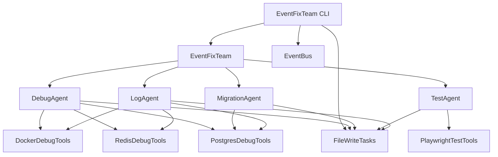

# EventFixTeam CLI

Command Line Interface für das EventFixTeam zum Testen und Debuggen.

## Installation

```bash
# CLI starten (vereinfachte Version)
python -m src.teams.event_fix_cli_simple --help
```

## Hinweis

Es gibt zwei Versionen der CLI:
1. **event_fix_cli.py** - Vollständige CLI mit EventFixTeam Integration (benötigt EventFixTeam)
2. **event_fix_cli_simple.py** - Vereinfachte CLI mit nur FileWriteTasks (keine EventFixTeam Abhängigkeit)

Die vereinfachte CLI wird empfohlen, da sie keine Import-Probleme hat.

## Befehle

### 1. EventFixTeam starten

```bash
python -m src.teams.event_fix_cli start
```

### 2. Task erstellen

```bash
# Fix Code Task
python -m src.teams.event_fix_cli create-task \
  --type fix_code \
  --priority high \
  --title "Fix Bug in User Service" \
  --description "Fix critical bug in user authentication" \
  --source "user"

# Migration Task
python -m src.teams.event_fix_cli create-task \
  --type migration \
  --priority medium \
  --title "Migrate Database Schema" \
  --description "Migrate user table to new schema" \
  --source "database"

# Test Fix Task
python -m src.teams.event_fix_cli create-task \
  --type test_fix \
  --priority high \
  --title "Fix Failing Tests" \
  --description "Fix failing unit tests in auth module" \
  --source "test"

# Log Analysis Task
python -m src.teams.event_fix_cli create-task \
  --type log_analysis \
  --priority low \
  --title "Analyze Performance Logs" \
  --description "Analyze performance logs for bottlenecks" \
  --source "monitoring"
```

### 3. Tasks auflisten

```bash
# Alle Tasks auflisten
python -m src.teams.event_fix_cli list-tasks

# Tasks nach Status filtern
python -m src.teams.event_fix_cli list-tasks --status pending
python -m src.teams.event_fix_cli list-tasks --status in_progress
python -m src.teams.event_fix_cli list-tasks --status completed
python -m src.teams.event_fix_cli list-tasks --status failed
```

### 4. Task Details anzeigen

```bash
python -m src.teams.event_fix_cli get-task --id <task-id>
```

### 5. Task Status aktualisieren

```bash
# Task auf "in_progress" setzen
python -m src.teams.event_fix_cli update-task \
  --id <task-id> \
  --status in_progress

# Task auf "completed" setzen
python -m src.teams.event_fix_cli update-task \
  --id <task-id> \
  --status completed \
  --result '{"fixed": true, "files_changed": ["app.py"]}'
```

### 6. Task löschen

```bash
python -m src.teams.event_fix_cli delete-task --id <task-id>
```

### 7. Statistiken anzeigen

```bash
python -m src.teams.event_fix_cli statistics
```

### 8. Event simulieren

```bash
# Error Event
python -m src.teams.event_fix_cli simulate-event \
  --type error \
  --source "docker" \
  --data '{"container": "app", "error": "Crash", "stack_trace": "..."}'

# Crash Event
python -m src.teams.event_fix_cli simulate-event \
  --type crash \
  --source "app" \
  --data '{"service": "user-service", "error": "Segmentation fault"}'

# Performance Event
python -m src.teams.event_fix_cli simulate-event \
  --type performance \
  --source "monitoring" \
  --data '{"metric": "response_time", "value": 5000, "threshold": 1000}'

# Test Failure Event
python -m src.teams.event_fix_cli simulate-event \
  --type test_failure \
  --source "test" \
  --data '{"test": "test_auth", "error": "AssertionError"}'

# Migration Event
python -m src.teams.event_fix_cli simulate-event \
  --type migration \
  --source "database" \
  --data '{"table": "users", "operation": "alter"}'
```

### 9. Tasks verarbeiten

```bash
# Alle Tasks verarbeiten
python -m src.teams.event_fix_cli process-tasks

# Maximale Anzahl von Tasks verarbeiten
python -m src.teams.event_fix_cli process-tasks --max-tasks 5
```

### 10. EventFixTeam stoppen

```bash
python -m src.teams.event_fix_cli stop
```

## Beispiele

### Beispiel 1: Kompletter Workflow

```bash
# 1. EventFixTeam starten
python -m src.teams.event_fix_cli start

# 2. Error Event simulieren
python -m src.teams.event_fix_cli simulate-event \
  --type error \
  --source "docker" \
  --data '{"container": "app", "error": "Crash"}'

# 3. Tasks auflisten
python -m src.teams.event_fix_cli list-tasks

# 4. Task Details anzeigen
python -m src.teams.event_fix_cli get-task --id <task-id>

# 5. Tasks verarbeiten
python -m src.teams.event_fix_cli process-tasks

# 6. Statistiken anzeigen
python -m src.teams.event_fix_cli statistics

# 7. EventFixTeam stoppen
python -m src.teams.event_fix_cli stop
```

### Beispiel 2: Task manuell erstellen und verarbeiten

```bash
# 1. EventFixTeam starten
python -m src.teams.event_fix_cli start

# 2. Task erstellen
python -m src.teams.event_fix_cli create-task \
  --type fix_code \
  --priority high \
  --title "Fix Bug in User Service" \
  --description "Fix critical bug in user authentication" \
  --source "user"

# 3. Tasks auflisten
python -m src.teams.event_fix_cli list-tasks

# 4. Task Status aktualisieren
python -m src.teams.event_fix_cli update-task \
  --id <task-id> \
  --status in_progress

# 5. Task Status auf completed setzen
python -m src.teams.event_fix_cli update-task \
  --id <task-id> \
  --status completed \
  --result '{"fixed": true, "files_changed": ["app.py"]}'

# 6. Statistiken anzeigen
python -m src.teams.event_fix_cli statistics

# 7. EventFixTeam stoppen
python -m src.teams.event_fix_cli stop
```

### Beispiel 3: Event-basierte Task-Erstellung

```bash
# 1. EventFixTeam starten
python -m src.teams.event_fix_cli start

# 2. Mehrere Events simulieren
python -m src.teams.event_fix_cli simulate-event \
  --type error \
  --source "docker" \
  --data '{"container": "app", "error": "Crash"}'

python -m src.teams.event_fix_cli simulate-event \
  --type crash \
  --source "app" \
  --data '{"service": "user-service", "error": "Segmentation fault"}'

python -m src.teams.event_fix_cli simulate-event \
  --type test_failure \
  --source "test" \
  --data '{"test": "test_auth", "error": "AssertionError"}'

# 3. Tasks auflisten
python -m src.teams.event_fix_cli list-tasks

# 4. Tasks verarbeiten
python -m src.teams.event_fix_cli process-tasks

# 5. Statistiken anzeigen
python -m src.teams.event_fix_cli statistics

# 6. EventFixTeam stoppen
python -m src.teams.event_fix_cli stop
```

## Task Types

| Type | Beschreibung |
|------|-------------|
| `fix_code` | Code-Fix Task |
| `migration` | Datenbank-Migration Task |
| `test_fix` | Test-Fix Task |
| `log_analysis` | Log-Analyse Task |

## Priorities

| Priority | Beschreibung |
|----------|-------------|
| `low` | Niedrige Priorität |
| `medium` | Mittlere Priorität |
| `high` | Hohe Priorität |
| `critical` | Kritische Priorität |

## Status

| Status | Beschreibung |
|--------|-------------|
| `pending` | Task wartet auf Verarbeitung |
| `in_progress` | Task wird verarbeitet |
| `completed` | Task wurde erfolgreich abgeschlossen |
| `failed` | Task ist fehlgeschlagen |

## Event Types

| Type | Beschreibung |
|------|-------------|
| `error` | Fehler-Event |
| `crash` | Absturz-Event |
| `performance` | Performance-Event |
| `test_failure` | Test-Fehler-Event |
| `migration` | Migrations-Event |

## Architektur



## Troubleshooting

### EventFixTeam startet nicht

```bash
# Prüfen, ob alle Abhängigkeiten installiert sind
pip install -r requirements.txt

# Prüfen, ob die EventFixTeam Dateien existieren
ls -la src/teams/event_fix_team.py
ls -la src/teams/agents/
ls -la src/teams/tools/
```

### Tasks werden nicht erstellt

```bash
# Prüfen, ob das tasks Verzeichnis existiert
ls -la tasks/

# Prüfen, ob die FileWriteTasks funktionieren
python -c "from src.teams.tools.file_write_tasks import FileWriteTasks; import asyncio; asyncio.run(FileWriteTasks().list_pending_tasks())"
```

### Events werden nicht verarbeitet

```bash
# Prüfen, ob der EventBus funktioniert
python -c "from src.teams.event_fix_team import EventBus; import asyncio; eb = EventBus(); asyncio.run(eb.publish('test', {'type': 'test'}))"
```

## Nächste Schritte

1. **Integration testen** - Integrieren Sie das EventFixTeam in Ihr bestehendes System
2. **Dokumentation lesen** - Lesen Sie die Dokumentation, um zu verstehen, wie das EventFixTeam funktioniert
3. **Beispiele ausprobieren** - Probieren Sie die Beispiele aus, um das EventFixTeam zu verstehen

## Hilfe

```bash
# Hilfe anzeigen
python -m src.teams.event_fix_cli --help

# Hilfe für einen bestimmten Befehl
python -m src.teams.event_fix_cli create-task --help
python -m src.teams.event_fix_cli list-tasks --help
python -m src.teams.event_fix_cli get-task --help
python -m src.teams.event_fix_cli update-task --help
python -m src.teams.event_fix_cli delete-task --help
python -m src.teams.event_fix_cli statistics --help
python -m src.teams.event_fix_cli simulate-event --help
python -m src.teams.event_fix_cli process-tasks --help
```
