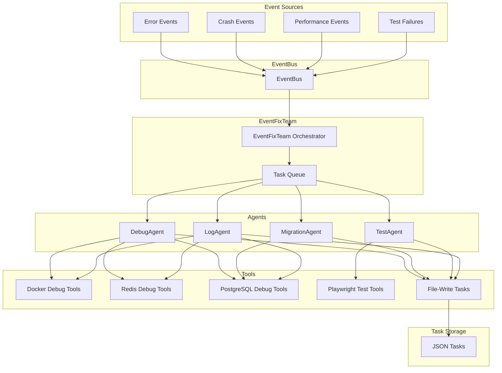

# EventFixTeam - Event-Driven Fix-Team

## Übersicht

Das EventFixTeam ist ein Multi-Agent-System für automatisierte Event-Fixes. Es verwendet ein Event-Driven Architecture Pattern, um auf Fehler, Crashes und Performance-Probleme zu reagieren.

## Architektur



## Komponenten

### 1. EventFixTeam Orchestrator

**Datei:** [`src/teams/event_fix_team.py`](src/teams/event_fix_team.py)

Der EventFixTeam Orchestrator ist der zentrale Koordinator für alle Fix-Operationen.

**Hauptfunktionen:**
- Event-Bus Integration
- Task-Queue Management
- Task-Verarbeitung und -Delegation
- Result-Aggregation

**Verwendung:**
```python
from src.teams.event_fix_team import EventFixTeam, EventFixConfig, FixTaskType, FixPriority

# Konfiguration
config = EventFixConfig(
    max_concurrent_tasks=5,
    task_timeout=300,
    auto_retry=True,
    max_retries=3,
)

# EventFixTeam erstellen
team = EventFixTeam(
    config=config,
    event_bus=event_bus,
    shared_state=shared_state,
)

# Team starten
await team.start()

# Fix-Task erstellen
task = await team.create_fix_task(
    task_type=FixTaskType.ERROR_FIX,
    priority=FixPriority.HIGH,
    description="Container crashed",
    metadata={"container": "my-app"},
)

# Tasks verarbeiten
result = await team.process_tasks(max_tasks=10)

# Team stoppen
await team.stop()
```

### 2. DebugAgent

**Datei:** [`src/teams/agents/debug_agent.py`](src/teams/agents/debug_agent.py)

Der DebugAgent analysiert Fehler und Crashes und erstellt Fix-Tasks.

**Verantwortlichkeiten:**
- Fehleranalyse mit Stack-Traces
- Crash-Analyse mit Container-Logs
- Root-Cause-Ermittlung
- Fix-Task-Erstellung

**Verwendung:**
```python
from src.teams.agents.debug_agent import DebugAgent, DebugContext

# DebugAgent erstellen
agent = DebugAgent(
    name="debug_agent",
    description="Analyzes errors and crashes",
    tools=[docker_tools, redis_tools, postgres_tools, file_write_tasks],
)

# Debug-Kontext erstellen
context = DebugContext(
    error_type="RuntimeError",
    error_message="Division by zero",
    stack_trace="...",
    container_name="my-app",
    service_name="api-service",
)

# Fehler analysieren
await agent._analyze_error(context)
```

### 3. MigrationAgent

**Datei:** [`src/teams/agents/migration_agent.py`](src/teams/agents/migration_agent.py)

Der MigrationAgent plant und erstellt Migrations-Tasks.

**Verantwortlichkeiten:**
- Schema-Migrationen planen
- Data-Migrationen planen
- Rollback-Plan-Generierung
- Migrations-Task-Erstellung

**Verwendung:**
```python
from src.teams.agents.migration_agent import MigrationAgent, MigrationContext

# MigrationAgent erstellen
agent = MigrationAgent(
    name="migration_agent",
    description="Plans and creates migration tasks",
    tools=[postgres_tools, file_write_tasks],
)

# Migrations-Kontext erstellen
context = MigrationContext(
    migration_type="schema",
    source_schema="v1",
    target_schema="v2",
    description="Add new column to users table",
)

# Migration planen
await agent._plan_migration(context)
```

### 4. TestAgent

**Datei:** [`src/teams/agents/test_agent.py`](src/teams/agents/test_agent.py)

Der TestAgent führt Tests aus und erstellt Test-Fix-Tasks.

**Verantwortlichkeiten:**
- E2E-Tests mit Playwright
- Visual-Regression-Tests
- Test-Fix-Task-Erstellung

**Verwendung:**
```python
from src.teams.agents.test_agent import TestAgent, TestContext

# TestAgent erstellen
agent = TestAgent(
    name="test_agent",
    description="Runs tests and creates test fix tasks",
    tools=[playwright_tools, file_write_tasks],
)

# Test-Kontext erstellen
context = TestContext(
    test_type="e2e",
    test_url="http://localhost:3000",
    test_selector="#submit-button",
    expected_behavior="Button is clickable",
    actual_behavior="Button is disabled",
)

# Test ausführen
await agent._run_test(context)
```

### 5. LogAgent

**Datei:** [`src/teams/agents/log_agent.py`](src/teams/agents/log_agent.py)

Der LogAgent analysiert Logs und Performance-Metriken.

**Verantwortlichkeiten:**
- Log-Analyse
- Performance-Analyse
- Fehlermuster-Erkennung
- Log-Analyse-Task-Erstellung

**Verwendung:**
```python
from src.teams.agents.log_agent import LogAgent, LogContext

# LogAgent erstellen
agent = LogAgent(
    name="log_agent",
    description="Analyzes logs and performance metrics",
    tools=[docker_tools, redis_tools, postgres_tools, file_write_tasks],
)

# Log-Kontext erstellen
context = LogContext(
    analysis_type="error_detection",
    time_range="1h",
    services=["api-service", "db-service"],
    containers=["api", "postgres"],
)

# Logs analysieren
await agent._analyze_logs(context)
```

## Tools

### Docker Debug Tools

**Datei:** [`src/teams/tools/docker_debug_tools.py`](src/teams/tools/docker_debug_tools.py)

Tools für Docker-Debugging:
- `get_container_logs()` - Container-Logs abrufen
- `get_container_status()` - Container-Status abrufen
- `get_container_stats()` - Container-Statistiken abrufen
- `list_containers()` - Container auflisten
- `execute_in_container()` - Befehle im Container ausführen
- `get_container_processes()` - Container-Prozesse abrufen
- `get_container_ports()` - Container-Ports abrufen

### Redis Debug Tools

**Datei:** [`src/teams/tools/redis_debug_tools.py`](src/teams/tools/redis_debug_tools.py)

Tools für Redis-Debugging:
- `get_keys_pattern()` - Keys mit Pattern suchen
- `get_key_info()` - Key-Informationen abrufen
- `get_key_value()` - Key-Wert abrufen
- `analyze_cache_hit_rate()` - Cache-Hit-Rate analysieren
- `get_memory_usage()` - Speichernutzung abrufen
- `get_recent_logs()` - Letzte Logs abrufen
- `get_slow_queries()` - Langsame Queries abrufen
- `delete_key()` - Key löschen
- `flush_cache()` - Cache leeren

### PostgreSQL Debug Tools

**Datei:** [`src/teams/tools/postgres_debug_tools.py`](src/teams/tools/postgres_debug_tools.py)

Tools für PostgreSQL-Debugging:
- `get_slow_queries()` - Langsame Queries abrufen
- `get_table_sizes()` - Tabellengrößen abrufen
- `get_connection_stats()` - Verbindungsstatistiken abrufen
- `get_schema_info()` - Schema-Informationen abrufen
- `get_index_info()` - Index-Informationen abrufen
- `execute_query()` - Query ausführen

### Playwright Test Tools

**Datei:** [`src/teams/tools/playwright_test_tools.py`](src/teams/tools/playwright_test_tools.py)

Tools für Playwright-Tests:
- `run_e2e_test()` - E2E-Test ausführen
- `capture_screenshot()` - Screenshot aufnehmen
- `get_page_metrics()` - Seiten-Metriken abrufen
- `run_visual_regression_test()` - Visual-Regression-Test ausführen
- `get_test_coverage()` - Test-Coverage abrufen

### File-Write Tasks

**Datei:** [`src/teams/tools/file_write_tasks.py`](src/teams/tools/file_write_tasks.py)

Tools für File-Write Tasks:
- `create_fix_task()` - Fix-Task erstellen
- `create_migration_task()` - Migrations-Task erstellen
- `create_test_fix_task()` - Test-Fix-Task erstellen
- `create_log_analysis_task()` - Log-Analyse-Task erstellen
- `list_pending_tasks()` - Ausstehende Tasks auflisten
- `get_task()` - Task abrufen
- `update_task_status()` - Task-Status aktualisieren
- `delete_task()` - Task löschen
- `get_task_statistics()` - Task-Statistiken abrufen

## Task-Typen

### FixTaskSpec

```python
@dataclass
class FixTaskSpec:
    task_id: str
    task_type: str  # "fix_code", "migration", "test_fix", "log_analysis"
    priority: str  # "critical", "high", "medium", "low"
    file_path: Optional[str]
    description: str
    suggested_fix: Optional[str]
    metadata: Dict[str, Any]
    created_at: str
    status: str  # "pending", "processing", "completed", "failed"
```

### MigrationTaskSpec

```python
@dataclass
class MigrationTaskSpec:
    task_id: str
    migration_type: str  # "schema", "data", "rollback"
    source_schema: str
    target_schema: str
    description: str
    rollback_plan: str
    dependencies: List[str]
    estimated_duration: str
    created_at: str
    status: str
```

### TestFixTaskSpec

```python
@dataclass
class TestFixTaskSpec:
    task_id: str
    test_type: str  # "e2e", "unit", "regression"
    test_file: Optional[str]
    test_url: Optional[str]
    test_selector: Optional[str]
    expected_behavior: str
    actual_behavior: str
    error_message: Optional[str]
    screenshot_path: Optional[str]
    suggested_fix: Optional[str]
    metadata: Dict[str, Any]
    created_at: str
    status: str
```

### LogAnalysisTaskSpec

```python
@dataclass
class LogAnalysisTaskSpec:
    task_id: str
    analysis_type: str  # "error_detection", "performance", "anomaly"
    time_range: str
    services: List[str]
    containers: List[str]
    keywords: List[str]
    error_count: int
    warning_count: int
    error_patterns: Dict[str, int]
    performance_issues: List[Dict[str, Any]]
    recommendations: List[str]
    metadata: Dict[str, Any]
    created_at: str
    status: str
```

## Event-Typen

### ErrorEvent

```python
@dataclass
class ErrorEvent:
    event_type: str = "error"
    error_type: str
    error_message: str
    stack_trace: str
    container_name: Optional[str]
    service_name: Optional[str]
    timestamp: str
```

### CrashEvent

```python
@dataclass
class CrashEvent:
    event_type: str = "crash"
    container_name: str
    service_name: str
    exit_code: int
    timestamp: str
```

### PerformanceEvent

```python
@dataclass
class PerformanceEvent:
    event_type: str = "performance"
    metric_name: str
    metric_value: float
    threshold: float
    container_name: Optional[str]
    service_name: Optional[str]
    timestamp: str
```

### TestFailureEvent

```python
@dataclass
class TestFailureEvent:
    event_type: str = "test_failure"
    test_type: str
    test_name: str
    test_file: Optional[str]
    test_url: Optional[str]
    error_message: str
    screenshot_path: Optional[str]
    timestamp: str
```

## Task-Storage

Alle Tasks werden als JSON-Dateien im `./event_fix_tasks` Verzeichnis gespeichert.

**Beispiel-Task-Datei:**
```json
{
  "task_id": "fix_a1b2c3d4",
  "task_type": "fix_code",
  "priority": "high",
  "file_path": "src/app.py",
  "description": "Division by zero error",
  "suggested_fix": "Add zero check before division",
  "metadata": {
    "container": "my-app",
    "service": "api-service"
  },
  "created_at": "2026-01-29T00:00:00",
  "status": "pending"
}
```

## Konfiguration

### EventFixConfig

```python
@dataclass
class EventFixConfig:
    max_concurrent_tasks: int = 5
    task_timeout: int = 300
    auto_retry: bool = True
    max_retries: int = 3
    enable_debug_logging: bool = False
```

## Nächste Schritte

1. **MCP Server für EventFix erstellen** - `mcp_plugins/servers/event_fix/agent.py`
2. **Event-Bus Integration testen** - Event-Subscription und -Broadcasting
3. **Tests erstellen** - Unit-Tests und Integration-Tests
4. **Dokumentation vervollständigen** - API-Dokumentation und Beispiele

## Lizenz

MIT
